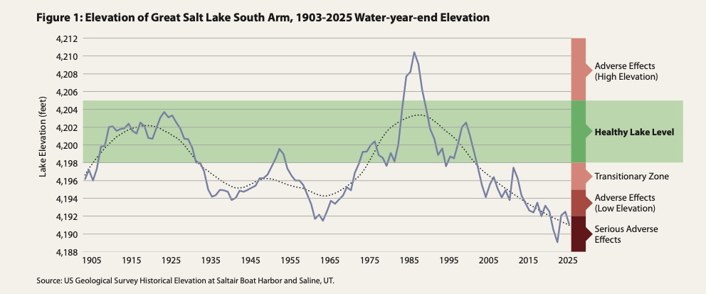
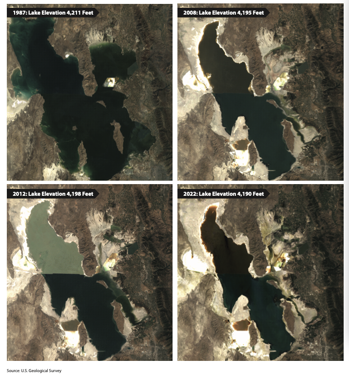

# Great Salt Lake

Great Salt Lake is a terminal (closed-basin) lake in northern Utah - water flows in but has no natural outlet, so it leaves only through evaporation. This makes the lake extremely sensitive to changes in inflow: small, sustained reductions in river deliveries compound over time into large drops in lake level, surface area, and volume. It is the largest saline lake in the Western Hemisphere, spanning roughly 1,700 square miles of open water and 360,000 acres of surrounding wetlands at its healthier elevations. It sustains roughly 80% of the state's wetlands and hosts an estimated 10 million migratory birds across over 330 species each year as a critical stop on the Pacific and Central Flyways. The lake underpins mineral extraction (magnesium, potash, salt), a brine shrimp industry that supplies feed for global aquaculture, and tourism/recreation. Estimates put the lake's total economic contribution to Utah at roughly \$1.9-2.5 billion annually. The lake and its wetlands hold long-standing cultural and spiritual significance for Indigenous tribes in the region ([Utah Rivers Council](https://utahrivers.org/protecting-the-great-salt-lake), [Utah Division of Natural Resources](https://water.utah.gov/wp-content/uploads/2022/11/Great-Salt-Lake-overview.pdf), [Utah Division of Water Resources](https://fogsl.org/about/map) , FRIENDS of Great Salt Lake).

### GSL Levels

Lake elevation (measured in feet above sea level) is the standard indicator of the lake's health. The Great Salt Lake Commissioner's Office, working with the Great Salt Lake Strike Team (University of Utah, Utah State University, and state agencies), developed a **Great Salt Lake Elevation Matrix** that scores ecological, economic, and recreational outcomes at different lake elevations. Based on this analysis, the state has adopted a **healthy target range of 4,198 - 4,205 feet** above sea level, which is roughly in line with the lake's average elevation over the past century ([Great Salt Lake Strategic Plan](https://greatsaltlake.utah.gov/wp-content/uploads/Great-Salt-Lake-Strategic-Plan-1.pdf)).

| **Elevation (ft)** | **Significance**                                                                                                                                                                                                             |
|--------------------|------------------------------------------------------------------------------------------------------------------------------------------------------------------------------------------------------------------------------|
| **4,207**          | Estimated long-term natural elevation of the lake absent human diversions.                                                                                                                                                   |
| **4,198 – 4,205**  | "Optimal"/healthy elevation range identified in the 2013 Great Salt Lake Management Plan's Elevation Matrix, adopted as the 30-year target range in the GSL Commissioner's Office's first Strategic Plan.                    |
| **4,198**          | Minimum healthy elevation — the level below which scientists say the lake ecosystem cannot function properly; used by the Utah DNR as the floor of the healthy range.                                                        |
| **4,195**          | Intermediate recovery milestone identified by the GSL Commissioner's Office — roughly the midpoint between the minimum healthy level and the threshold for serious adverse effects, and the start of a "transitionary zone". |
| **4,192**          | Trigger elevation below which serious adverse ecological and economic effects are expected ([KSL](https://www.ksl.com/article/50955308/))                                                                                    |
| **4,188.5**        | Historic record low, reached in November 2022.                                                                                                                                                                               |
| **\~4,190.4**      | South Arm elevation as of mid-August 2026 — just above the 2021 low and approaching the 2022 record low ([Salt Lake Tribune, Aug 16 2026](https://www.sltrib.com/news/2026/08/16/what-happens-if-great-salt-lake/))          |

Over the past two decades, the lake has been below the "optimal" elevation range of 4,198 - 4,205 feet, hitting a historic low of 4,188.5 feet in 2022 and sitting at roughly 4,190 feet as of mid-2026 which is still several feet below the minimum healthy level of 4,198 feet.

Figure: GSL historical levels with reference healthy, transitionary and adverse effects zones. Source ([Great Salt Lake Strike Team Report, 2026](https://d36oiwf74r1rap.cloudfront.net/wp-content/uploads/2026/01/GSL-Jan2026.pdf))

As the lake shrinks, exposed lakebed becomes a source of wind-blown dust — some of it containing heavy metals such as arsenic, lead, and cadmium - which is a growing air-quality and public-health concern for the Wasatch Front. Lower lake levels also mean less "lake-effect" moisture reaching nearby mountains; the lake is credited with contributing roughly 5-10% of the region's celebrated snowpack and extending the ski season by five to seven weeks ([FRIENDS of Great Salt Lake](https://fogsl.org/about/map)).

Figure : GSL shirking over the years

### Closing the gap: How much water do we need to recover the lake levels?

It is estimated that we will need about **800,000 acre-feet** (some estimates of 1M acft) of sustained additional inflow per year to return the lake to healthy levels (4,198 feet) by 2055. This is equivalent to more than four years of all human water use in Utah combined. Between 2021 and 2025, only about 400,000 acre-feet total were dedicated and delivered to the lake against a target of 471,000-1,055,000 acre-feet per year needed to reach 4,198 ft ([Utah Rivers Council](https://utahrivers.org/protecting-the-great-salt-lake), [Great Salt Lake Strike Team Report, 2026](https://d36oiwf74r1rap.cloudfront.net/wp-content/uploads/2026/01/GSL-Jan2026.pdf)).

An emergency streamflow requirement of at least **2.5 million acre-feet per year** is need until it reaches 4,198 feet, which translates to a need for roughly **0.7 to 1.2 million acre-feet per year of additional conservation** – which would need a 30-50% reduction in current human depletions across the watershed ([BYU briefing on GSL:](https://pws.byu.edu/GSL%20report%202023)).

The lake depends almost entirely on inflow from the Bear, Weber, and Jordan Rivers, where the Bear River contributes 60% of the inflows, making upstream management decisions in basins like the Bear River directly consequential for the lake's health.
