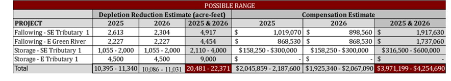

# Pricing Benchmarks for Water

There is no set pricing standard for water markets in Utah. Some possible benchmarks are different state programs aimed at conservation, leasing and renting water. A summary is given below

Table 1: Benchmarks for water pricing

| **Program / Entity**                                                                                                                                    | **State** | **Year**    | **Transaction Type** | **Cost (\$/acft)** |
|---------------------------------------------------------------------------------------------------------------------------------------------------------|-----------|-------------|----------------------|--------------------|
| GSL Watershed Enhancement Trust                                                                                                                         | UT        | 5 – 10 yrs  | Lease                | \$36 - \$72        |
| [Water Supply Bank](https://idwr.idaho.gov/iwrb/programs/water-supply-bank/pricing/)                                                                    | ID        | 2024, 2025  | Bank                 | \$23, \$33         |
| Demand Management Program (DMP)                                                                                                                         | UT        | 2025 - 2026 | Fallowing / Leasing  | \$190 - \$194      |
| [DMP - Price River Water User Association](https://cra.utah.gov/utah-colorado-river-agricultural-water-resilience-demand-management-pilot-program-2-2/) | UT        | 2025-2026   | Forbear              | \$ 150             |
| [System Conservation Pilot Program](https://cra.utah.gov/system-conservation-pilot-program/)                                                            | UT        | 2024        | Forbear              | \$150              |

## Calculations for water pricing (\$/acft) in Table

### GSL Watershed Enhancement Trust Water Lease for GSL

Great Salt Lake Watershed Enhancement Trust committed \$1M to lease about 2500 acft of water annually from Metropolitan Water District of Salt Lake City & Sandy for next 5 - 10 years. Calculating the cost of water per acre-foot.

Assuming 10% operating/administrative costs, the cost to lease water = \$900 k

*Assuming a 5-year lease*

Amount of water leased = 2500 \* 5 = 12,500 acft

Cost per acft = \$ 900,000 / 12,500 acft = \$ 72 /acft

*Assuming a 10- year water lease*

Amount of water leased = 2500 \* 10 = 25,000 acft

Cost per acft = \$ 900,000 / 25,000 acft = \$ 36 /acft

### Utah’s Demand Management Pilot Program

In the Colorado River Basin in Utah, the program is aimed at reducing water depletions through “temporary, voluntary, compensated, and protected water conservation actions”. Several applications have been approved under the program for 2025 and 2026 with an estimated savings of 20,481 – 22,371 acft of water.

  
Figure 1: Possible range of water savings and estimated costs (Source: [Colorado River Authority of Utah](https://cra.utah.gov/wp-content/uploads/2026/02/20250618_FY26_WorkPlan_BOARD-APPROVED-w.-CH-edit-1.pdf))

Thus, cost of water (\$/acft) = Compenstaion estimate (\$)/ Depletion Estimate (acft) = 190 - 194 \$/acft

Price River Water User Association: [Forbearance Pilot Project](https://cra.utah.gov/utah-colorado-river-agricultural-water-resilience-demand-management-pilot-program-2-2/) cost of water = \$ 150 per acre-foot of conserved depletion.

### Cache Valley Water Banking model

Collaborators in the previous [immersive modeling](https://digitalcommons.usu.edu/cgi/viewcontent.cgi?article=1016&context=cee_stures) sessions for a water bank in Cache Valley, UT used prices from **\$15 - \$300 per acre-foot**.

-   Collaborators quoted bench external benchmarks like the Upper Colorado River Basin and California (\~\$500/acft). In these cases, collaborators set the Cache Valley price at approximately 50% (\~\$250/acft).
