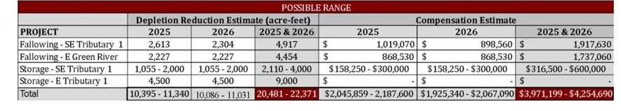

# Reference Budgets for GSL Related Conservation Programs

Below are some references for budgets allocated or committed to different conservation measures for GSL restoration.

Table 1: Programs for GSL restoration and conservation

| **Program / Entity**                                                                                                                                                                | **Budget / commitment** | **Focus**                                                                       | **Volume (acft)**                     |
|-------------------------------------------------------------------------------------------------------------------------------------------------------------------------------------|-------------------------|---------------------------------------------------------------------------------|---------------------------------------|
| [Bureau of Reclamation -\> GSL Commissioner’s Office + Utah DNR](https://greatsaltlake.utah.gov/wp-content/uploads/GSLCO-WIP-Advance-Notice-Informal-Announcement.pdf)              | \$ 50 M                 | Voluntary Water Transactions, System Conservation, Ecosystem and Habitat        |                                       |
| [Great Salt Lake Watershed Enhancement Trust](https://le.utah.gov/Session/2022/bills/static/HB0410.html)                                                                            | \$ 40 M                 | Conservation projects                                                           | -                                     |
| [Utah Forestry, Fire and State Lands (FFSL) acquisition of US Mg plant](https://www.upr.org/environment/2026-02-23/utah-bought-one-of-its-biggest-polluters-what-does-this-mean)    | \$ 30 M                 | Acquiring water rights                                                          | \~145k                                |
| [Great Salt Lake Long-Term Water Program](https://cobi.utah.gov/2025/3896/issues/23206) (GSL Commissioner’s Office)                                                                 | \$ 1M                   | Water leases + infrastructure to conserve, dedicate, and deliver water for GSL. |                                       |
| GSL Watershed Enhancement Trust + Metropolitan Water Dist. of SLC and Sandy                                                                                                         | \$1 M                   | Municipal lease for GSL                                                         | \~2500 / year (12k - 25k in 10 years) |
| [Agricultural Water Optimization Program](https://le.utah.gov/Session/2023/bills/static/SB0277.html)                                                                                | \$200 M                 | Agricultural Water conservation                                                 | 40k – 60k per year                    |
| [Great Salt Lake Preservation Program](https://le.utah.gov/Session/2026/bills/static/HB0410.html)                                                                                   | \$2.75 M                | Water Leasing for GSL                                                           | -                                     |
| [President’s 2027 Budget Request](https://www.whitehouse.gov/wp-content/uploads/2026/04/budget_fy2027.pdf) (p 34)                                                                   | \$1 B                   | GSL restoration and protection                                                  | -                                     |
| [Price River Water User Association Storage Forbearance Pilot Project](https://cra.utah.gov/utah-colorado-river-agricultural-water-resilience-demand-management-pilot-program-2-2/) | \$3 M                   | Voluntary Forbearance                                                           | \~2k                                  |
| [Utah private and non-profit sector](https://www.sltrib.com/news/environment/2025/09/24/can-200m-save-great-salt-lake-utah/)                                                        | \$200 M                 |                                                                                 |                                       |

# Pricing Benchmarks for Water

There is no set pricing standard for water markets in Utah. Some possible benchmarks are different programs aimed at conservation, leasing and renting water. A summary is given in Table 2.

Table 2: Benchmarks for water pricing

| **Program / Entity**                                                                                                                                                                      | **Basin / State**        | **Years**  | **Transaction Type** | **Cost (\$/acft)** | **Volume (Acft)** |
|-------------------------------------------------------------------------------------------------------------------------------------------------------------------------------------------|--------------------------|------------|----------------------|--------------------|-------------------|
| [Water Supply Bank](https://idwr.idaho.gov/iwrb/programs/water-supply-bank/pricing/)                                                                                                      | ID                       | 2024, 2025 | Bank / water rental  | \$23, \$33         |                   |
| Demand Management Program (DMP)                                                                                                                                                           | Colorado River Basin, UT | 2025-2026  | Fallowing / Leasing  | \$190 - \$194      | 20k 22k           |
| [DMP - Price River Water User Association Storage Forbearance Pilot Project](https://cra.utah.gov/utah-colorado-river-agricultural-water-resilience-demand-management-pilot-program-2-2/) | Price River, UT          | 2025-2026  | Forbear              | \$150              | Upto 2k           |
| [System Conservation Pilot Program](https://cra.utah.gov/system-conservation-pilot-program/)                                                                                              | UT                       | 2024       | Forbear              | \$150              |                   |
| Cache Valley Water Bank Model                                                                                                                                                             | UT                       |            | Banking              | \$15 - \$300       |                   |
|  Desalination costs                                                                                                                                                                       | CA                       |            |                      | \~1500 - 3000      |                   |
|                                                                                                                                                                                           | Israel                   | -          | -                    | \~\$150 - 1200     |                   |

## Calculations for water pricing (\$/acft) in Table 2

### Utah’s Demand Management Pilot Program

In the Colorado River Basin in Utah, the program is aimed at reducing water depletions through “temporary, voluntary, compensated, and protected water conservation actions”. Several applications have been approved under the program for 2025 and 2026 with an estimated savings of 20,481 – 22,371 acft of water.

  
Figure 1: Possible range of water savings and estimated costs (Source: [Colorado River Authority of Utah](https://cra.utah.gov/wp-content/uploads/2026/02/20250618_FY26_WorkPlan_BOARD-APPROVED-w.-CH-edit-1.pdf))

Thus, cost of water (\$/acft) = Compensation estimate (\$)/ Depletion Estimate (acft) = 190 - 194 \$/acft

Price River Water User Association: [Forbearance Pilot Project](https://cra.utah.gov/utah-colorado-river-agricultural-water-resilience-demand-management-pilot-program-2-2/) cost of water = \$ 150 per acre-foot of conserved depletion.

### Cache Valley Water Banking model

Collaborators in the previous [immersive modeling](https://digitalcommons.usu.edu/cgi/viewcontent.cgi?article=1016&context=cee_stures) sessions for a water bank in Cache Valley, UT used prices from **\$15 - \$300 per acre-foot**.

-   Collaborators quoted bench external benchmarks like the Upper Colorado River Basin and California (\~\$500/acft). In these cases, collaborators set the Cache Valley price at approximately 50% (\~\$250/acft).

# Voluntary Contributions / Donations for GSL

| **Entity**                                  | **Contribution (acft)**      | **Years** |
|---------------------------------------------|------------------------------|-----------|
| UT Division of FFSL and Compass Minerals    | 201,000                      | -         |
| Church of Jesus Christ of Latter-day Saints | \~20,000 (5700 water shares) | -         |
