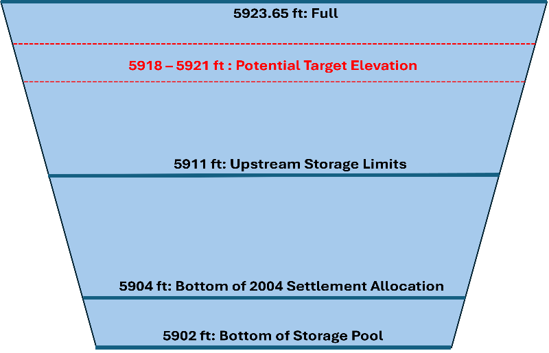

# Immersive Model for a Water Bank for Bear River Basin

## Purpose

The purpose of this immersive online collaborative model is to give collaborators the opportunity to immerse in and personify water user roles for a water bank for Bear River Basin. The tool is useful for two purposes; as researchers we want to know A) Why do people decide to consume, conserve, bank, and deliver water within the immersive modeling environments? B) Which new insights do participants take away from a model session? C) How can an immersive online collaborative modeling approach help generate holistic strategies to address the multidisciplinary, multi-user, and conflict-laden problem to get more water to Great Salt Lake?

## Key Ideas

The model works on the following principles: A) Store winter flows in Bear Lake. B) Allocate summer natural flows to users based on historic flows C) Allocate water from Bear Lake storage (if applicable) D) Users consume, conserve or trade within their available water, other’s choices, and real-time discussion of choices. E) Bank decides the amount of water to deliver to GSL based on the banked water.

Figure 1: Bear Lake Storage Profile

### Potential Target Elevation (PTE)

The Bear Lake's level is managed based on its level at the end of the irrigation season. PacifiCorp determines the PTE, which represents the elevation of Bear Lake to be achieved on March 31st of each year. PTE ranges from 5916 ft - 5920 ft (high runoff – low runoff), and is adjusted to accommodate changing weather forecasts, downstream constraints, irrigation demands. and runoff variations

**PTE Aug – Dec:** PacifiCorp sets the PTE at the end of the irrigation season which is updated monthly until March 31st of the following year. During the irrigation season, if lake elevation is greater than 5,918 and the irrigation demand for storage water is not enough to reach 5,918 by the end of the irrigation season, stored water may be released in late July/August.

**PTE Jan – Mar:** PaciCorp adjusts the PTE as per spring runoff forecasts and local inflows to the lake. Under normal conditions, PacifiCorp sets PTE at 5918 ft. If the elevation is 5918 ft or higher, releases are scheduled to maintain this level by March 31st. If it's below 5918 ft, water releases are delayed until forecasts indicate the lake can reach that elevation or if high snowpack requires flood control releases. During winter, if forecasts suggest below-average runoff, releases may be curtailed even if the elevation exceeds 5918 ft. Generally, water will not be released from Bear Lake when its elevation is below the PTE, except during emergencies or for flood control. This strategy balances long-term water supply needs during droughts with flood control requirements.

If the Bear Lake elevation is below the PTE from the end of the irrigation season to March 31st of the following year, releases are curtailed until the lake is predicted to reach the PTE.

### Additional Depletions

Different users have allowance of additional depletions per Bear River compact.

1.  Different divisions in the Bear River Basin are allowed additional storage or depletion under certain conditions. The upstream Bear Lake users are allowed an additional storage of 74,000 acft such that the depletions do not exceed 28,000 acft in any year IF the Bear Lake level on Apr 1st is more than 5911 ft. In the model, this depletion amount is used. If users don’t deplete this amount, it is sold to the bank.

For lower ID, the users are allowed an additional 125,000 acft of depletion if water is available. If users have excess water available and they don’t deplete this amount, it is sold to the bank.

## Model

To use, download the Excel Model File, move to Google Sheets, and invite participants. There are accounts for different water users in the Bear River Basin. Over one or more years, participants consume, conserve or trade water in the accounts. Read on for directions to use.

### Model Assumptions

1.  All the depletions occur in the summer season. Winter depletions are negligible.
2.  We use natural flow in the model. It is the flow that would have been observed if there were no depletions,
    -   Natural Flow = Gaged Flow + depletions upstream.
3.  The streamflow losses (evaporation, seepage, delivery losses) are assumed to be 10% for each reach for summer season and 3.33% (1/3rd of summer season) for winter season. Cell 25 – 27 shows streamflow assumptions.
4.  All the users in the model represent agricultural use.
5.  The Bear River Canal Company in the model represents the uses in Tremonton.
6.  The users make decisions to consume, conserve or trade water based on historic water use, which is used in the model as a proxy to the water they are entitled to use.

### Considerations for Users

1.  WY, Upstream Bear Lake Users : The user can sell water to the bank but cannot conserve water for next years or draw from the bear lake.
2.  Lower ID: The user can sell water to the bank, draw from and conserve water in the bear lake (bank) to be draw in the subsequent years.
3.  Cache Valley: Cache Valley users draw water from the Little Bear River – Logan River system, they cannot bank water in Bear Lake.
    -   The user cannot draw from or store water in the bear lake (bank)
    -   The net water available from Cache Valley for the “Bank” is assumed to kept in reservoirs or “Bank” in Cache Valley and made available in winter season (Ref: [Cache Valley Water Bank](https://www.hydroshare.org/resource/31793214a3794afd8a33141fda0933bf/)). This water is excluded from the banked water in Bear Lake.
4.  Lower UT
    -   The user can sell water to the bank, draw from and conserve water in the bear lake (bank) to be draw in the subsequent years.

### Requirements

1.  Session Guide: 1 person to set up in Google Sheets (see Setup below), invite participants, and organize play.
2.  Number of People: 2 or more (Session Guide may also participate).
3.  Time: 1 to 2 hours.
4.  Software: Session Guide has a Google Account.

## Directions to Guide a Model Session

### Setup

1.  Download the file [BearRiverWaterBank.xlsx](https://github.com/HaadiaBaig/BearRiverWaterBank/blob/main/ModelFiles/BearRiverWaterBank.xlsx) to your computer.
2.  Move the Excel file to your Google Drive. Open as a Google Sheet.
3.  Open the *Versions* Worksheet to see updates.
4.  Duplicate the *Model* Worksheet to work on in this session and save a blank version for later use.
5.  Invite 1 or more other people to join the Google Sheet.
    1.  In the upper right of the Google Sheet, click the Share button.
    2.  Add emails and set permissions so players can access the Google Sheet. Or copy and share the sheet's URL.

### Use.

1.  On the Model worksheet, scroll down Column B. The instructions are given in rows with Blue text. For example, in **Rows 6-11**, participants select a User and enter the User's Strategy to participate in the banking. If fewer than 5 participants, participants select multiple parties.
    -   Sample strategies
        -   Meet the water requirement for users.
        -   Preserve agricultural production. Buy if needed and sell if in excess.
        -   Save water to get to Great Salt Lake.
        -   Try banking to understand how it might work for the Bear River Basin.
        -   Bank stores water in the Bear Lake in summer, deliver to GSL in winter.

Start of the water year: October

2.  In **Cell 24**, select the Bear Lake starting level for start of the water year.
    -   The model calculates the beginning of water year Bear Lake Storage.

Figure 1: Historic elevation of Bear Lake at the beginning of water year(ft)

3.  In **Cell 28,** select natural flow from the drop-down list. The list contains estimated historic natural flows for water years 2004 - 2001.
    -   The model also shows the year for the selected flow.

Figure 2: Historic Natural Flows for Bear River Basin

4.  **Cell 31-45:** The model shows the estimated winter natural flow (October – March) for the selected flow / year.
5.  The winter natural flow from upstream bear lake is added to the bear lake storage (assuming there are no diversions in winter season).

### Bear Lake Operations

6.  **Row 37 – 45** contains data for Bear Lake based on operation decision.
7.  **Row 38** select the March 1st Potential Target Elevation (PTE) for the Bear Lake. This is the elevation to be achieved for Bear Lake on March 31st. Historically, PTE is kept at 5916 ft for expected high runoff years to accommodate spring runoff, 5920 ft for low runoff years, and 5918 ft in average year ([Read about Potential Target Elevation](#potential-target-elevation-pte)).
    -   If there is excess water in the lake corresponding to the lake level, excess water is spilled.

### Summer Flows (April – September)

8.  **Row 47-51**, the model calculates the natural flow from April – September for each user.
9.  **Row 53-57**, the model calculates the historic depletions by each user.

### Participant Dashboard

10. Beginning of year account balance : It is the water conserved in the previous year, its ‘0’ for Year 1.
11. Model shows the historic natural flow, non-agricultural depletions, streamflow losses, and upstream depletions for each user.
    -   For Cache Valley, UT the non ag depletions are considered to be 0 as mainly all of the urban water is sourced from underground sources.
12. Model allocates available natural flow to each user, calculated by the formula

    *Available water = Natural Flow – Streamflow losses – Non-Ag Depletions – Upstream consumptive use derived from flow (if any) – water sold to the bank by upstream users – water conserved in the bank by upstream users.*

13. ‘UT, WY upstream Bear Lake’ cannot conserve water in the bank as they cannot draw water from the lake in next years.
14. Model shows if there is any additional depletion is allowed based on the Bear River Compact and / or other agreement.
15. Model shows the historic consumptive use for the year for the user.
16. In Year 2 – 4 User decides is they want to use any water from conserved storage from pervious years.
17. Model calculates the total depletions allowed based on historic uses, compact provisions and conserved storage if used.

    *Total Depletions allowed = Volume of historic consumptive use + Additional depletions possible based on compact provisions*

18. The user decides the consumptive use of water that year based on ‘allowable depletions’ values.
    -   If there is enough water available in the river, the user gets water from the available water. For users downstream Bear Lake, the users can take additional water from the lake to meet their consumptive use without a charge.
    -   If the available water is less than the historic water use, then the users can either decide to take water from the lake or sell their entitlement from the lake to the bank.
    -   If the user decides to consume more than allowed depletions, they need to buy the water from bank.
19. Model shows the water available after consumptive use.
    -   The user decides how much water do they want to buy from or sell to the bank.
    -   If the user sells portion of their water available after consumptive use, the remaining water is added to the conserved water, that acts as the end of year account balance.
20. Model calculates the water to sell or buy based on the user’s decision of consumptive use.
21. User sets or negotiates the price of water (\$/acft) with the bank. [(See guidelines for pricing.](#pricing))
22. Model shows the net income or expense and the end of year account balance.

### Bank Summary

23. **Row 143 – 158**, the model calculates the net water traded, the compensation (\$), and the end of year cumulative storage for the bank.

### End of Summer

### Bear Lake Summary

24. Row **160 – 170**: The model summarizes the Bear Lake levels at the beginning of year and at the end of summer after all uses, trades and deliveries from Bear Lake have happened.

### Bank Delivery to the Great Salt Lake

25. **Row 174**, model calculates the available Bear Lake storage using the formula
    -   Available Bear Lake Storage = End of summer Lake storage – User accounts balance.
26. Model calculates end of year cumulative bank storage.
27. The bank decides how much water to deliver to the Great Salt Lake. It cannot deliver more than the cumulative bank storage available.
28. **Row 177**: End of year bank storage = Cumulative bank storage – Water delivered to the GSL
29. **Row 179-180**: Model calculates End of year Bear Lake storage and Levels.
30. The end of year Bear Lake level becomes the beginning of year Bear Lake level for the next year.

## Pricing

There is no set pricing standard for water markets in Utah. Some possible bench marks are

### GSL Watershed Enhancement Trust Water Lease for GSL

Great Salt Lake Watershed Enhancement Trust committed \$1M to lease about 2500 acft of water annually from Metropolitan Water District of Salt Lake City & Sandy for next 5 - 10 years. We can calculate the cost of water per acre-foot.

Assuming a lease for 5 years

Cost per acft = $$\frac{\$ \  1 , 000 , 0 0 0 \  \ }{2500 * 5 \  a c f t} = \$ \mathbf{80} \mathbf{\ } \mathbf{a c f t}$$

Assuming a lease for 10 years

Cost per acft = $$\frac{\$ \  1 , 000 , 0 0 0 \  \ }{2500 * 1 0 \  a c f t} = \$ \mathbf{40} \mathbf{\ } \mathbf{a c f t}$$

### Utah’s Demand Management Program

The estimated savings from [Utah’s demand management program](https://cra.utah.gov/utah-colorado-river-agricultural-water-resilience-demand-management-pilot-program-2-2/) for Colorado River Basin is 22,600 acft. The program will spend [\$4M for fallowing](https://www.kuer.org/science-environment/2025-02-14/utah-seems-ready-to-pay-farmers-to-leave-more-water-in-the-colorado-river). We can estimate cost of water

Cost per acft = $$\frac{\$ \  4 , 000 , 0 0 0 \  \ }{22 , 0 0 0 \  a c f t} = \sim \$ \mathbf{\ } \mathbf{178} \mathbf{\ } \mathbf{a c f t}$$

For 2025 – 2026 year, the program estimates a cost of **\$390 per acft** for water conserved.

Price River Water User Association: Forbearance Pilot Project cost of water = 150 per acre-foot of conserved depletion.

### Benchmarking from Neighboring States

ID Water Supply bank: 33 \$/acft in 2025

### Cache Valley Water Banking model

-   Collaborators in work used prices from **\$15 - \$300 per acre-foot**.
    -   Collaborators quoted bench external benchmarks like the Upper Colorado River Basin and California (\~\$500/acft). In these cases, collaborators set the Cache Valley price at approximately 50% (\~\$250/acft).

## File Description

1.  Data \> Natural Flow: Data and R code to calculate Natural Flow for the model users.
2.  IRB: Approved documents for Institutional Review Board.
3.  Model Files \> [BearRiverWaterBank.xlsx](https://github.com/HaadiaBaig/BearRiverWaterBank/blob/main/ModelFiles/BearRiverWaterBank.xlsx) : Model file for Bear River Water Bank
4.  Experiments : Older versions of the model using different scenarios.
