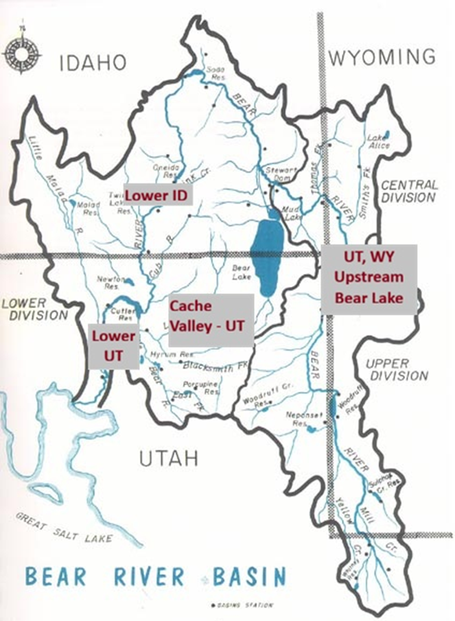

# Immersive Model for a Water Bank for Bear River Basin

## Purpose

The purpose of this immersive online collaborative model is to help generate holistic strategies to get more water to the Great Salt Lake (GSL). The tool is useful for two purposes: as researchers, we want to know A) Why do people decide to consume, conserve, bank, and deliver water within immersive modeling environments? B) Which new insights do participants take away from a model session? C) How can an immersive online collaborative modeling approach help generate holistic strategies to address the multidisciplinary, multi-user, and conflict-laden problem to get more water to Great Salt Lake? Second, collaborators get an opportunity to immerse in and personify water user roles in Bear River Basin, while making decisions to consume, conserve, and bank water.

## Key Ideas

The model is based on the following principles: A) Store winter flows in Bear Lake B) Allocate summer natural flows to users based on historic flows C) Allocate water from Bear River or from Bear Lake storage (if applicable) D) Users consume, conserve or trade within their available water, other’s choices, and real-time discussion of choices E) Bank decides the amount of water to deliver to GSL from the banked water.

## Great Salt Lake

Great Salt Lake (GSL) is a terminal (closed-basin) lake; water flows in from the Bear, Weber, and Jordan Rivers with no natural outlet, so it leaves only through evaporation, making it highly sensitive to changes in inflow. GSL is the largest saline lake in the Western Hemisphere, it sustains \~80% of Utah's wetlands and roughly 10 million migratory birds of over 330 species each year, and underpins a mineral, brine-shrimp, and tourism economy worth an estimated \$1.9-2.5 billion annually ([Utah Rivers Council](https://utahrivers.org/protecting-the-great-salt-lake), [Utah Division of Natural Resources](https://water.utah.gov/wp-content/uploads/2022/11/Great-Salt-Lake-overview.pdf), [Utah Division of Water Resources](https://fogsl.org/about/map)).

### Great Salt Lake Critical Levels

The state has adopted a healthy target range of **4,198-4,205 ft** above sea level Below **4,192 ft**, serious adverse ecological and economic effects are expected ([Great Salt Lake Strategic Plan](https://greatsaltlake.utah.gov/wp-content/uploads/Great-Salt-Lake-Strategic-Plan-1.pdf)).

Over the past two decades, the lake has been below the ‘optimal’ elevation range of 4,198 - 4,205 ft, hitting a historic low of 4,188.5 feet in 2022. As of mid 2026, the lake is roughly at 4,190 ft which is still several feet below the minimum healthy level of 4,198 ft.

Figure 1: GSL historical levels with reference healthy, transitionary and adverse effects zones. Source ([Great Salt Lake Strike Team Report, 2026](https://d36oiwf74r1rap.cloudfront.net/wp-content/uploads/2026/01/GSL-Jan2026.pdf))

As the lake shrinks, exposed lakebed becomes a source of wind-blown dust, some of it containing heavy metals such as arsenic, lead, and cadmium - which is a growing air-quality and public-health concern for the Wasatch Front. Lower lake levels also mean less "lake-effect" moisture reaching nearby mountains; the lake is credited with contributing roughly 5-10% of the region's celebrated snowpack and extending the ski season by five to seven weeks ([FRIENDS of Great Salt Lake](https://fogsl.org/about/map)).

### Closing the gap: How much water do we need to recover the lake levels?

It is estimated that we will need about **800,000 acre-feet** (some estimates of 1M acft) of sustained additional inflow per year to return the lake to healthy levels (4,198 feet) by 2055. This is equivalent to over four years of all human water use in Utah combined. Between 2021 and 2025, only about 400,000 acre-feet total were dedicated and delivered to the lake against a target of 471,000-1,055,000 acre-feet per year needed to reach 4,198 ft ([Utah Rivers Council](https://utahrivers.org/protecting-the-great-salt-lake), [Great Salt Lake Strike Team Report, 2026](https://d36oiwf74r1rap.cloudfront.net/wp-content/uploads/2026/01/GSL-Jan2026.pdf)). ([Read More About GSL](https://github.com/HaadiaBaig/BearRiverWaterBank/blob/main/AdditionalInformation/GreatSaltLake.md#great-salt-lake))

## Bear River Basin

Bear River is an interstate river in Utah, Wyoming, and Idaho, encompassing approximately 500 square miles. It originates in the Uinta Mountains of northeastern Utah, flows north into Wyoming, then west and south through Idaho, and ultimately returns to Utah before discharging into the Great Salt Lake. Key hydrologic features of the basin include Bear Lake, a large natural lake used for water storage and hydropower regulation, and a system of reservoirs, diversions, and irrigation infrastructure that support agricultural, municipal, industrial, and ecological uses. Average annual flows vary considerably due to snowpack-driven runoff and climatic conditions, requiring coordinated interstate management under established legal and operational frameworks.

The water allocation and management in the Bear River Basin are governed by an interconnected framework of interstate compacts, federal legislation, court decrees, state water laws, and administrative institutions ([Read more on Bear River Compact and agreements](https://github.com/HaadiaBaig/BearRiverWaterBank/blob/main/AdditionalInformation/BearRiverManagement.md#bear-river-basin-management)).

## Bear Lake

Bear Lake is a large natural freshwater lake on the Utah–Idaho border. It functions as a major storage reservoir, regulating flows in the Bear River for irrigation and hydropower generation. Bear Lake is also ecologically significant and supports native fish species and important recreational activities.

Figure 2: Bear Lake Storage Profile

### Bear Lake Potential Target Elevation (PTE)

The Bear Lake's level is managed based on its level at the end of the irrigation season. PacifiCorp determines the PTE, which represents the elevation of Bear Lake to be achieved on March 31st of each year. PTE ranges from 5916 ft - 5920 ft (high runoff – low runoff), and is adjusted to accommodate changing weather forecasts, downstream constraints, irrigation demands. and runoff variations

**PTE Aug – Dec:** PacifiCorp sets the PTE at the end of the irrigation season, which is updated monthly until March 31st of the following year. During the irrigation season, if lake elevation is greater than 5,918 and the irrigation demand for storage water is not enough to reach 5,918 by the end of the irrigation season, stored water may be released in late July/August.

**PTE Jan – Mar:** PaciCorp adjusts the PTE as per spring runoff forecasts and local inflows to the lake. Under normal conditions, PacifiCorp sets PTE at 5918 ft. If the elevation is 5918 ft or higher, releases are scheduled to maintain this level by March 31st. If it's below 5918 ft, water releases are delayed until forecasts indicate the lake can reach that elevation or if high snowpack requires flood control releases. During winter, if forecasts suggest below-average runoff, releases may be curtailed even if the elevation exceeds 5918 ft. Generally, water will not be released from Bear Lake when its elevation is below the PTE, except during emergencies or for flood control. This strategy balances long-term water supply needs during droughts with flood control requirements.

If the Bear Lake elevation is below the PTE from the end of the irrigation season to March 31st of the following year, releases are curtailed until the lake is predicted to reach the PTE. ([Read more on Bear Lake Operations](https://bearrivercommission.org/docs/Operations%20Agreement%20for%20PacifiCorps%20Bear%20River%20System.pdf))

## Bear River, Bear Lake and Great Salt Lake

The Bear River, Bear Lake, and Great Salt Lake function as a single interconnected hydrologic system rather than three separate water bodies. The Bear River supplies roughly 30% of inflow to Bear Lake and roughly 60% of flow to the Great Salt Lake, directly linking upstream flow decisions to the ecological health of both downstream lakes - including Bear Lake's four endemic fish species and the Great Salt Lake's temperature, salinity, water level, and migratory bird habitat.

This connection also runs in reverse: as the Great Salt Lake has declined, pressure has increased on Bear Lake and Bear River water specifically, since the Bear River is the lake's largest tributary — meaning GSL's crisis is intensifying competition for water further up the system, not just downstream of it. This interconnection means water management decisions in the Bear River Basin carry economic trade-offs that extend well beyond the basin itself. Reallocating water toward one use, such as additional irrigation or municipal growth, reduces what's available for hydropower, recreation, and downstream lake deliveries, with an estimated \$1.95 billion in annual Bear River economic value at risk if flows are reduced or degraded. Decisions made anywhere in the basin ripple through the entire system's ecology and economy.

([Read More: Regional Economic Values of the Bear River,](https://www.conservationecon.org/_files/ugd/5fc209_6630204e5cc64833a93b6e214bfe5e2b.pdf) [Case Study of Bear Lake Regional Economic Contributions and Environmental Impacts](https://jrap.scholasticahq.com/article/146693-regional-economic-contributions-and-environmental-impacts-in-rural-areas-a-case-study-of-idaho-and-utah-s-bear-lake)).

## The Challenge

**Conservation alone is not sufficient;** any saved water has to actually reach and stay in the river system (rather than being reallocated to new uses) in order to raise the lake. ([University of Utah, Strike Team roadmap](https://attheu.utah.edu/science-technology/strike-team-updates-roadmap-for-rescuing-great-salt-lake-identifying-how-much-water-is-needed/)). This is exactly the function a water bank like the one modeled for the Bear River Basin is designed to provide: it aggregates water sold/banked by users and delivers a defined volume to GSL, primarily in the winter when diversions and losses are lowest. This immersive water bank model also explores how voluntary, market-based strategies among Bear River Basin water users and states can help deliver more water sustained over years to the lake.

The lake depends almost entirely on inflow from the Bear, Weber, and Jordan Rivers, where the Bear River contributes 60% of the inflows, making upstream management decisions in basins like the Bear River directly consequential for the lake's health.

## Model

To use, download the [Excel Model File](https://github.com/HaadiaBaig/BearRiverWaterBank/blob/main/ModelFiles/BearRiverWaterBank.xlsx) (Click on ‘View raw’ to download the file), move to Google Sheets, and invite participants. There are accounts for different water users in the Bear River Basin. Over one or more years, participants consume, conserve, or trade water in the accounts. Read on for directions on how to use.

### Model Setup

The water users in the model are 1) UT, WY users upstream Bear Lake 2) Lower ID users (Users below Bear Lake in ID) 3) Cache Valley, UT (Users in UT that are in Logan River – Little Bear River Watershed 4) Lower UT (Utah users excluding Cache Valley and Malad river users).

Figure 3: Water Users as in the Immersive Model (Original Map: UT Division of Water Rights)

The model is set up for a seasonal time step: October–March: Winter inflows, April–September: Summer flow and user decisions for water use, conservation, trade, and pricing (Figure 4).

Figure 4: Model setup and choices

### Model Assumptions

1.  All the users in the model represent agricultural uses.
2.  All the depletions occur in summer. Winter depletions are negligible.
3.  We use natural flow in the model. It is the flow that would have been observed if there were no depletions,

    *Natural Flow = Gaged Flow + depletions upstream.*

4.  The streamflow losses (evaporation, seepage, delivery losses) are assumed to be 10% for each reach during the summer season and 3.33% (1/3rd of summer season) for winter season. Row 21-22 shows streamflow assumptions.
5.  The users make decisions to consume, conserve, or trade water based on historic water use, which is used in the model as a proxy to their water entitlement. They might have some additional water available based on compact allocations or conserved water available from previous years.
6.  Decisions are made on a yearly basis.

### Considerations for Users

1.  Users can only trade water with the bank and not amongst themselves.
2.  WY, Upstream Bear Lake Users, Lower ID, Lower UT: The users can sell water to the bank, and conserve water in the bear lake (bank) to be drawn in the subsequent years.
3.  Cache Valley: Cache Valley users draw water from the Little Bear River – Logan River system.
    -   The user cannot draw from or store water in the bear lake.
    -   The net water available from Cache Valley for the “Bank” is assumed to kept in reservoirs or ‘bank’ in Cache Valley and made available in winter season (Ref: [Cache Valley Water Bank](https://www.hydroshare.org/resource/31793214a3794afd8a33141fda0933bf/)).
4.  For users downstream Bear Lake (Lower ID, Lower UT) : If the water use is less than the flow available, the water is delivered from the river flow.
    -   If the water use is more than the flow available, the exceeded flow is delivered from the Bear Lake.
5.  Bank
    -   The bank manages two storages in the model. One is Bear Lake and the other is in Cache Valley.
    -   The banked water is delivered to GSL in winter season when the diversions and losses are minimum.

### Additional Depletions Under Amended Bear River Compact

Different divisions in the Bear River Basin are allowed additional storage or depletion under certain conditions.

1.  The Upper and Central Divisions (Upstream Bear Lake users in our model) are allowed an additional storage of 74,000 ac-ft such that the depletions do not exceed 28,000 ac-ft in any year **IF** the Bear Lake level on Apr 1st is more than 5911 ft. In the model, this depletion amount is used. If users don’t deplete this amount, it is sold to the bank.
2.  ID is allowed first right to an additional 125,000 ac-ft of depletion if water is available.
    -   In the model. If users have excess water available and they don’t deplete this amount, it can be conserved or sold to the bank.
3.  UT is allowed an additional 275,000 ac-ft of depletions if water is available.
    -   In the model. If users have excess water available and they don’t deplete this amount, it can be conserved or sold to the bank.

## Directions to Guide a Model Session

### Requirements

1.  Session Guide: 1 person to set up in Google Sheets (see Setup below), invite participants, and organize play.
2.  Number of People: 2 or more (Session Guide may also participate).
3.  Time: 1 to 2 hours.
4.  Software: Session Guide has a Google Account.

The following section contains details on how to guide a model session.

### Setup

1.  Download the file [BearRiverWaterBank.xlsx](https://github.com/HaadiaBaig/BearRiverWaterBank/blob/main/ModelFiles/BearRiverWaterBank.xlsx) to your computer, (Click on ‘View raw’ to download the file).
2.  Move the Excel file to your Google Drive. Open as a Google Sheet.
3.  Open the *Versions* worksheet to see updates.
4.  Duplicate the *Model* Worksheet to work on in this session and save a blank version for later use.
5.  Invite 1 or more other people to join the Google Sheet.
    1.  In the upper right of the Google Sheet, click the Share button.
    2.  Add emails and set permissions so players can access the Google Sheet. Or copy and share the sheet's URL.

### Use

1.  On the Model worksheet, scroll down Column B. The instructions are given in rows with Blue text. For example, in **Rows 6-11**, participants select a User and enter the User's Strategy to participate in the banking. If fewer than 5 participants, participants select multiple parties.

#### Sample strategies

**Users**

-   Keep available water for irrigation.
-   Preserve agriculture (90%), conserve to 10% buffer, bank all else.
-   Maximize profitability while balancing Great Salt Lake deliveries.
-   Protect agricultural areas / users.
-   Maximize profits.
-   Preserve agricultural production. Buy if needed and sell if in excess.
-   Save water to get to the Great Salt Lake.

**Bank**

-   Maximize number of transactions and water delivered to GSL.
-   Maximize Great Salt Lake conserved water.
-   Bank stores water in Bear Lake in summer, deliver to GSL in winter.
-   Try banking to understand how it might work for the Bear River Basin.

### Start of the water year: October

1.  **Cell C13:** The user representing bank decides on a total budget for water bank assuming four years of operation.
2.  In **Cell C33,** select the Bear Lake starting level for start of the water year.
    -   The model calculates the beginning of water year Bear Lake Storage.

Figure 5: Historic elevation of Bear Lake at the beginning of water year(ft)

3.  In **Row 37,** select natural flow from the drop-down list. The list contains estimated historic natural flows for water years 2004 - 2001.
    -   The model also shows the year for the selected flow.

Figure 6: Historical Natural Flows for Bear River Basin

4.  **Row 40-45:** The model shows the GSL levels, volume and the surface area at the start of the water year for corresponding year.

Figure 7: Historical Great Salt Lake Levels

5.  **Row 47-51:** The model shows the estimated winter natural flow (October – March) for the selected flow / year.
    -   The winter natural flow from upstream bear lake is added to the bear lake storage (assuming there are no diversions in winter season).

### Bear Lake Operations

6.  **Row 53-59** contains data for Bear Lake based on operation decision.
7.  **Row 55:** select the March 1st Potential Target Elevation (PTE) for the Bear Lake. This is the elevation to be achieved for Bear Lake on March 31st. Historically, PTE is kept at 5916 ft for expected high runoff years to accommodate spring runoff, 5920 ft for low runoff years, and 5918 ft in average year ([Read about Potential Target Elevation](https://github.com/HaadiaBaig/BearRiverWaterBank#bear-lake-potential-target-elevation-pte)).
    -   If there is excess water in the lake corresponding to the lake level, excess water is spilled.

### Summer Flows (April – September)

8.  **Row 63-67:** the model calculates the natural flow from April – September for each user.
9.  **Row 69-73**, the model calculates the historic depletions by each user.

    

Figure 8: Historical Depletions in Bear River Basin

### Participant Dashboard

10. The participant dashboard is divided into two sections; one is for the water bank and the other is for the users
11. **Cell C78:** shows the total budget for the water bank.
12. **Row 79**: Shows the remaining bank budget for each year.
13. **Row 84 – 179:** User dashboard for other water users.
14. Beginning of year account balance: It is the water conserved in the previous year, its ‘0’ for Year 1.

### 

Figure 9: Participant Dashboard in the model file

15. Model shows the historic natural flow, non-agricultural depletions, streamflow losses, and upstream depletions for each user.
    -   For Cache Valley, UT the non ag depletions are considered to be 0 as mainly all of the urban water is sourced from underground sources.
16. Model allocates available natural flow to each user, calculated by the formula

    *Available water = Natural Flow – Streamflow losses – Non-Ag Depletions – Upstream consumptive use derived from flow (if any) – water sold to the bank by upstream users – water conserved in the bank by upstream users.*

17. Model shows if there is any additional depletion is allowed based on the Bear River Compact and / or other agreement(s).
18. Model shows the historic consumptive use for the year for the user.
19. Model calculates the total depletions allowed based on historic uses, compact provisions and conserved storage.

    *Total Depletions allowed = Volume of historic consumptive use + Additional depletions possible based on compact provisions + water used from previous year banked storage (starting in Year 2).*

20. The user decides the consumptive use of water that year based on ‘allowable depletions’ values.
    -   If there is enough water available in the river, the user gets water from the available water. For users downstream Bear Lake, the users can take additional water from the lake to meet their consumptive use without a charge.
    -   If the available water is less than the historic water use, then the users can either decide to take water from the lake or sell their entitlement from the lake to the bank.
    -   If the user decides to consume more than allowed depletions, they need to buy the water from bank.
21. Model shows the water available after consumptive use.
    -   The user decides how much water do they want to buy from or sell to the bank.
    -   If the user sells portion of their water available after consumptive use, the remaining water is added to the conserved water, that acts as the end of year account balance.
22. Model calculates the water to sell or buy based on the user’s decision of consumptive use.
23. User sets or negotiates the price of water (\$/acft) with the bank. [(See benchmarks for pricing.](https://github.com/HaadiaBaig/BearRiverWaterBank/blob/main/AdditionalInformation/Pricing.md#pricing))
24. Model shows the net income or expense and the end of year account balance.

### Bank Summary

25. **Row 181-208**, the model calculates the net water traded, the compensation (\$), and the end-of-year cumulative storage for the bank in Bear Lake and in Cache Valley.
26. **Row 197-201,** the model calculates the total net water traded by the bank and the net storage available in the bank.
27. **Row 203-208:** Summary of the total budget, transaction costs each year and remaining budget for the water bank.

*Remaining Total Budget (\$) = Total budget – (Total transaction costs in previous years + Transaction costs in present year).*

### End of Summer

### Bear Lake Summary

28. **Row 210-221:** The model summarizes the Bear Lake levels at the beginning of year and at the end of summer after all uses, trades and deliveries from Bear Lake have happened.

### GSL Summary

29. **Row 223-226:** The model calculates the flows to GSL from Jordan River, Weber River and other basins.
30. **Row 228-237:** The model calculates the end of summer levels, surface area and volume of GSL.

### Delivering Water for GSL

31. **Row 240**: model calculates the available Bear Lake storage using the formula,

    Available Bear Lake Storage = End of summer Bear Lake storage – User accounts balance in Bear Lake.

32. **Row 241-242:** Model calculates the end of summer season bank storage.
33. **Row 243-245:** The bank decides how much water to deliver to GSL from the banked storage in Bear Lake and in Cache Valley. It cannot deliver more than the end-of-year banked storage available.

### End of Year Summary

34. **Row 248-249:** End of year bank storage = Cumulative bank storage – Water delivered to the GSL.
35. **Row 252-254:** End of Year GSL levels, volume and surface area.
36. **Row 256-257**: Model calculates end of year Bear Lake storage and elevation.
    -   The end of year Bear Lake level becomes the beginning of year Bear Lake level for the next year.
37. **Row 259:** Move to next year.

## Pricing

There is no set pricing standard for water markets in Utah. Some benchmarks can be used to justify pricing ([Read about pricing strategies](https://github.com/HaadiaBaig/BearRiverWaterBank/blob/main/AdditionalInformation/Pricing.md#pricing)).

## File Description

1.  Data \> Natural Flow: Data and R code to calculate Natural Flow for the model users.
2.  IRB: Approved documents for Institutional Review Board.
3.  Model Files \> [BearRiverWaterBank.xlsx](https://github.com/HaadiaBaig/BearRiverWaterBank/blob/main/ModelFiles/BearRiverWaterBank.xlsx) : Model file for Bear River Water Bank
4.  Experiments: Older versions of the model using different scenarios.
