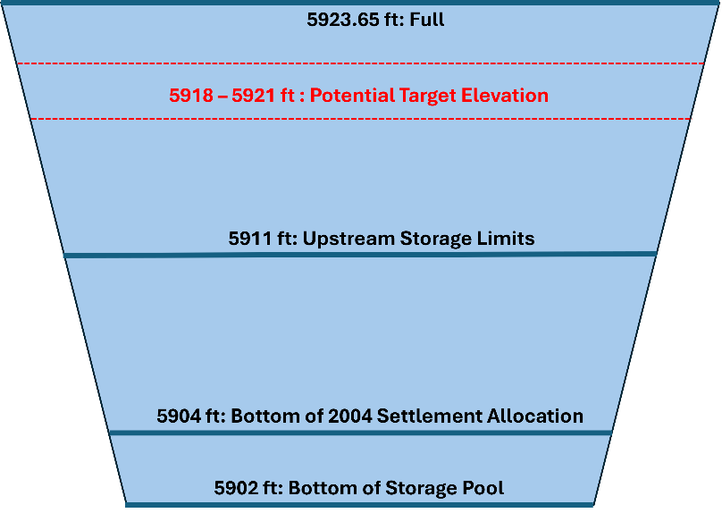
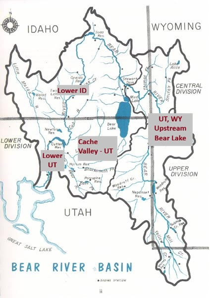
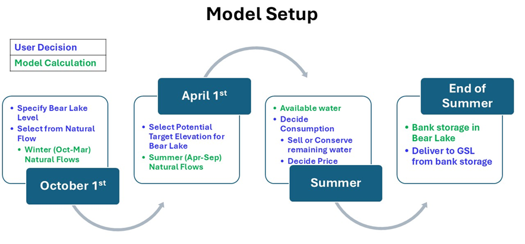
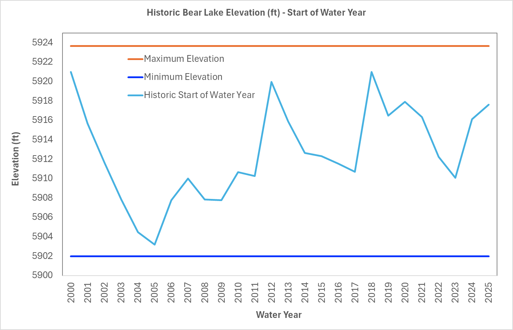
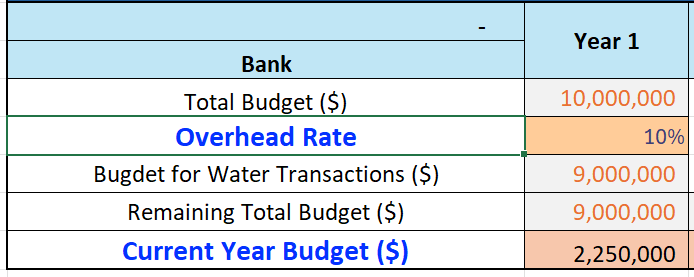

# Immersive Model for a Water Bank for Bear River Basin

## Purpose

The purpose of this immersive online collaborative model is to give collaborators the opportunity to immerse in and personify water user roles for a water bank for Bear River Basin. The tool is useful for two purposes; as researchers we want to know A) Why do people decide to consume, conserve, bank, and deliver water within the immersive modeling environments? B) Which new insights do participants take away from a model session? C) How can an immersive online collaborative modeling approach help generate holistic strategies to address the multidisciplinary, multi-user, and conflict-laden problem to get more water to Great Salt Lake?

## Key Ideas

The model works on the following principles: A) Store winter flows in Bear Lake B) Allocate summer natural flows to users based on historic flows C) Allocate water from Bear River or from Bear Lake storage (if applicable) D) Users consume, conserve or trade within their available water, other’s choices, and real-time discussion of choices E) Bank decides the amount of water to deliver to GSL based on the banked water.

### Bear River Basin

Bear River is an interstate river in Utah, Wyoming, and Idaho, encompassing approximately 500 square miles. It originates in the Uinta Mountains of northeastern Utah, flows north into Wyoming, then west and south through Idaho, and ultimately returns to Utah before discharging into the Great Salt Lake. Key hydrologic features of the basin include Bear Lake, a large natural lake used for water storage and hydropower regulation, and a system of reservoirs, diversions, and irrigation infrastructure that support agricultural, municipal, industrial, and ecological uses. Average annual flows vary considerably due to snowpack-driven runoff and climatic conditions, requiring coordinated interstate management under established legal and operational frameworks.

The water allocation and management in the Bear River Basin are governed by an interconnected framework of interstate compacts, federal legislation, court decrees, state water laws, and administrative institutions ([Read more on Bear River Compact and agreements](https://github.com/HaadiaBaig/BearRiverWaterBank/blob/main/AdditionalInformation/BearRiverManagement.md#bear-river-basin-management)).

Bear Lake is a large natural freshwater lake located on the Utah–Idaho border and. It functions as a major storage reservoir, regulating flows in the Bear River for irrigation and hydropower generation. Bear Lake is also ecologically significant and supports unique native fish species and important recreational activities.

Figure 1: Bear Lake Storage Profile

### Bear Lake Potential Target Elevation (PTE)

The Bear Lake's level is managed based on its level at the end of the irrigation season. PacifiCorp determines the PTE, which represents the elevation of Bear Lake to be achieved on March 31st of each year. PTE ranges from 5916 ft - 5920 ft (high runoff – low runoff), and is adjusted to accommodate changing weather forecasts, downstream constraints, irrigation demands. and runoff variations

**PTE Aug – Dec:** PacifiCorp sets the PTE at the end of the irrigation season which is updated monthly until March 31st of the following year. During the irrigation season, if lake elevation is greater than 5,918 and the irrigation demand for storage water is not enough to reach 5,918 by the end of the irrigation season, stored water may be released in late July/August.

**PTE Jan – Mar:** PaciCorp adjusts the PTE as per spring runoff forecasts and local inflows to the lake. Under normal conditions, PacifiCorp sets PTE at 5918 ft. If the elevation is 5918 ft or higher, releases are scheduled to maintain this level by March 31st. If it's below 5918 ft, water releases are delayed until forecasts indicate the lake can reach that elevation or if high snowpack requires flood control releases. During winter, if forecasts suggest below-average runoff, releases may be curtailed even if the elevation exceeds 5918 ft. Generally, water will not be released from Bear Lake when its elevation is below the PTE, except during emergencies or for flood control. This strategy balances long-term water supply needs during droughts with flood control requirements.

If the Bear Lake elevation is below the PTE from the end of the irrigation season to March 31st of the following year, releases are curtailed until the lake is predicted to reach the PTE. ([Read more on Bear Lake Operations](https://bearrivercommission.org/docs/Operations%20Agreement%20for%20PacifiCorps%20Bear%20River%20System.pdf))

## Model

To use, download the [Excel Model File](https://github.com/HaadiaBaig/BearRiverWaterBank/blob/main/ModelFiles/BearRiverWaterBank.xlsx), move to Google Sheets, and invite participants. There are accounts for different water users in the Bear River Basin. Over one or more years, participants consume, conserve or trade water in the accounts. Read on for directions to use.

### Model Setup

The water users in the model are 1) UT, WY users upstream Bear Lake 2) Lower ID users (Users below Bear Lake in ID) 3) Cache Valley, UT (Users in UT that are in Logan River – Little Bear River Watershed 4) Lower UT (Utah users excluding Cache Valley and Malad river users).

Figure 2: Water Users as in the Immersive Model (Original Map: UT Division of Water Rights)

The model is set up for a seasonal time step as follows, October–March: Winter inflows, April–September: Summer flow and user decisions for water use, conservation, trade and pricing (Figure 2).

Figure 3: Model setup and choices

### Model Assumptions

1.  All the users in the model represent agricultural uses.
2.  All the depletions occur in the summer season. Winter depletions are negligible.
3.  We use natural flow in the model. It is the flow that would have been observed if there were no depletions,

    *Natural Flow = Gaged Flow + depletions upstream.*

4.  The streamflow losses (evaporation, seepage, delivery losses) are assumed to be 10% for each reach for summer season and 3.33% (1/3rd of summer season) for winter season. Row 21-22 shows streamflow assumptions.
5.  The users make decisions to consume, conserve, or trade water based on historic water use, which is used in the model as a proxy to the water their water entitlement.
6.  Users can only bank water from the current year’s flow available. They cannot bank water that was conserved in their account in the previous years.

### Considerations for Users

1.  Users can only trade water with the bank.
2.  WY, Upstream Bear Lake Users: The user can sell water to the bank but cannot conserve water for next years as they cannot draw water from the lake in next years.
3.  Lower ID: The user can sell water to the bank, draw from and conserve water in the bear lake (bank) to be drawn in the subsequent years.
4.  Cache Valley: Cache Valley users draw water from the Little Bear River – Logan River system.
    -   The user cannot draw from or store water in the bear lake.
    -   The net water available from Cache Valley for the “Bank” is assumed to kept in reservoirs or ‘bank’ in Cache Valley and made available in winter season (Ref: [Cache Valley Water Bank](https://www.hydroshare.org/resource/31793214a3794afd8a33141fda0933bf/)).
5.  Lower UT
    -   The user can sell water to the bank, draw from and conserve water in the bear lake (bank) to be drawn in the subsequent years.
6.  For users downstream Bear Lake (Lower ID, Lower UT) : If the water use is less than the flow available, the water is delivered form the river flow.
    -   If the water use is more than the flow available, the exceeded flow is delivered from the Bear Lake.
7.  Bank
    -   The bank manages two storages in the model. One is Bear Lake and the other is in Cache Valley.
    -   The banked water is delivered to GSL In winter season when the diversions and losses are minimum.

### Additional Depletions Under Amended Bear River Compact

Different divisions in the Bear River Basin are allowed additional storage or depletion under certain conditions.

1.  The Upper and Central Divisions (Upstream Bear Lake users in our model) are allowed an additional storage of 74,000 ac-ft such that the depletions do not exceed 28,000 ac-ft in any year **IF** the Bear Lake level on Apr 1st is more than 5911 ft. In the model, this depletion amount is used. If users don’t deplete this amount, it is sold to the bank.
2.  ID is allowed first right to an additional 125,000 ac-ft of depletion if water is available.
    1.  In the model. If users have excess water available and they don’t deplete this amount, it can be conserved or sold to the bank.
3.  UT is allowed an additional 275,000 ac-ft of depletions if water is available.
    1.  In the model. If users have excess water available and they don’t deplete this amount, it can be conserved or sold to the bank.

### Requirements

1.  Session Guide: 1 person to set up in Google Sheets (see Setup below), invite participants, and organize play.
2.  Number of People: 2 or more (Session Guide may also participate).
3.  Time: 1 to 2 hours.
4.  Software: Session Guide has a Google Account.

## Directions to Guide a Model Session

### Setup

1.  Download the file [BearRiverWaterBank.xlsx](https://github.com/HaadiaBaig/BearRiverWaterBank/blob/main/ModelFiles/BearRiverWaterBank.xlsx) to your computer.
2.  Move the Excel file to your Google Drive. Open as a Google Sheet.
3.  Open the *Versions* Worksheet to see updates.
4.  Duplicate the *Model* Worksheet to work on in this session and save a blank version for later use.
5.  Invite 1 or more other people to join the Google Sheet.
    1.  In the upper right of the Google Sheet, click the Share button.
    2.  Add emails and set permissions so players can access the Google Sheet. Or copy and share the sheet's URL.

### Use.

1.  On the Model worksheet, scroll down Column B. The instructions are given in rows with Blue text. For example, in **Rows 6-11**, participants select a User and enter the User's Strategy to participate in the banking. If fewer than 5 participants, participants select multiple parties.
    -   Sample strategies
        -   Meet the water requirement for users.
        -   Preserve agricultural production. Buy if needed and sell if in excess.
        -   Save water to get to Great Salt Lake.
        -   Try banking to understand how it might work for the Bear River Basin.
        -   Bank stores water in the Bear Lake in summer, deliver to GSL in winter.

Start of the water year: October

2.  **Cell C13:** The user representing bank decides on a total budget for water bank assuming four years of operation.
3.  In **Cell C25**, select the Bear Lake starting level for start of the water year.
    -   The model calculates the beginning of water year Bear Lake Storage.

Figure 4: Historic elevation of Bear Lake at the beginning of water year(ft)

4.  In **Row 29,** select natural flow from the drop-down list. The list contains estimated historic natural flows for water years 2004 - 2001.
    -   The model also shows the year for the selected flow.

Figure 5: Historic Natural Flows for Bear River Basin

5.  **Row 32 - 36:** The model shows the estimated winter natural flow (October – March) for the selected flow / year.
    -   The winter natural flow from upstream bear lake is added to the bear lake storage (assuming there are no diversions in winter season).

### Bear Lake Operations

6.  **Row 38 – 46** contains data for Bear Lake based on operation decision.
7.  **Row 40:** select the March 1st Potential Target Elevation (PTE) for the Bear Lake. This is the elevation to be achieved for Bear Lake on March 31st. Historically, PTE is kept at 5916 ft for expected high runoff years to accommodate spring runoff, 5920 ft for low runoff years, and 5918 ft in average year ([Read about Potential Target Elevation](https://github.com/HaadiaBaig/BearRiverWaterBank#bear-lake-potential-target-elevation-pte)).
    -   If there is excess water in the lake corresponding to the lake level, excess water is spilled.

### Summer Flows (April – September)

8.  **Row 48-52**, the model calculates the natural flow from April – September for each user.
9.  **Row 54-58**, the model calculates the historic depletions by each user.

    

Figure 6: Historic Depletions in Bear River Basin

### Participant Dashboard

10. The participant dashboard is divided into two sections; one is for the water bank and the other is for the users
11. **Cell C63** shows the total budget for the water bank. The user representing the bank chooses an estimated overhead cost.
    -   The model calculates the budget available for water transactions.
12. **Row 67**: The bank decides the budget for each year from the total budget,

    ]

    Figure 7: User dashboard for bank choices

13. **Row 69 – 157:** User dashboard for other water users.
14. Beginning of year account balance: It is the water conserved in the previous year, its ‘0’ for Year 1.

### 

Figure 7: Participant Dashboard in the model file

15. Model shows the historic natural flow, non-agricultural depletions, streamflow losses, and upstream depletions for each user.
    -   For Cache Valley, UT the non ag depletions are considered to be 0 as mainly all of the urban water is sourced from underground sources.
16. Model allocates available natural flow to each user, calculated by the formula

    *Available water = Natural Flow – Streamflow losses – Non-Ag Depletions – Upstream consumptive use derived from flow (if any) – water sold to the bank by upstream users – water conserved in the bank by upstream users.*

17. Model shows if there is any additional depletion is allowed based on the Bear River Compact and / or other agreement(s).
18. Model shows the historic consumptive use for the year for the user.
19. In Year 2 – 4 User decides is they want to use any water from conserved storage from previous years.
20. Model calculates the total depletions allowed based on historic uses, compact provisions and conserved storage if used.

    *Total Depletions allowed = Volume of historic consumptive use + Additional depletions possible based on compact provisions + water used from previous year banked storage (starting in Year 2).*

21. The user decides the consumptive use of water that year based on ‘allowable depletions’ values.
    -   If there is enough water available in the river, the user gets water from the available water. For users downstream Bear Lake, the users can take additional water from the lake to meet their consumptive use without a charge.
    -   If the available water is less than the historic water use, then the users can either decide to take water from the lake or sell their entitlement from the lake to the bank.
    -   If the user decides to consume more than allowed depletions, they need to buy the water from bank.
22. Model shows the water available after consumptive use.
    -   The user decides how much water do they want to buy from or sell to the bank.
    -   If the user sells portion of their water available after consumptive use, the remaining water is added to the conserved water, that acts as the end of year account balance.
23. Model calculates the water to sell or buy based on the user’s decision of consumptive use.
24. User sets or negotiates the price of water (\$/acft) with the bank. [(See benchmarks for pricing.](https://github.com/HaadiaBaig/BearRiverWaterBank/blob/main/AdditionalInformation/Pricing.md#pricing))
25. Model shows the net income or expense and the end of year account balance.

### Bank Summary

26. **Row 159-172**, the model calculates the net water traded, the compensation (\$), and the end of year cumulative storage for the bank in Bear Lake and in Cache Valley.
27. **Row 174-181:** Summary of the total budget, transaction costs each year and remaining budget for the water bank.

*Remaining Total Budget (\$) = Total transaction costs in previous years + Transaction costs in present year.*

### End of Summer

### Bear Lake Summary

28. Row **183-193:** The model summarizes the Bear Lake levels at the beginning of year and at the end of summer after all uses, trades and deliveries from Bear Lake have happened.

### Bank Delivery to the Great Salt Lake

29. **Row 197**: model calculates the available Bear Lake storage using the formula
    -   Available Bear Lake Storage = End of summer Lake storage – User accounts balance.
30. **Row 198-199:** Model calculates end of year bank storage.

### Delivering Water for GSL

31. **Row 200-202**: The bank decides how much water to deliver to the Great Salt Lake. It cannot deliver more than the end of year banked storage available.

### End of year summary

32. **Row 204-207:** End of year bank storage = Cumulative bank storage – Water delivered to the GSL
33. **Row 208-209**: Model calculates End of year Bear Lake storage and Levels.
    -   The end of year Bear Lake level becomes the beginning of year Bear Lake level for the next year.
34. **Row 211:** Move to next year

## Pricing

There is no set pricing standard for water markets in Utah. Some benchmarks can be used to justify pricing ([Read about pricing strategies](https://github.com/HaadiaBaig/BearRiverWaterBank/blob/main/AdditionalInformation/Pricing.md#pricing)).

## File Description

1.  Data \> Natural Flow: Data and R code to calculate Natural Flow for the model users.
2.  IRB: Approved documents for Institutional Review Board.
3.  Model Files \> [BearRiverWaterBank.xlsx](https://github.com/HaadiaBaig/BearRiverWaterBank/blob/main/ModelFiles/BearRiverWaterBank.xlsx) : Model file for Bear River Water Bank
4.  Experiments: Older versions of the model using different scenarios.
