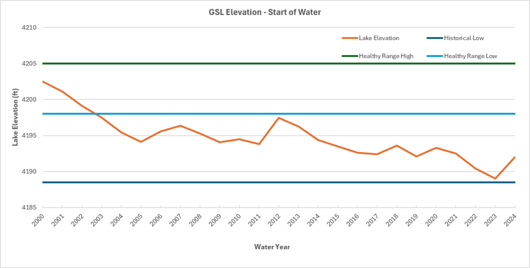

# Immersive Model for a Water Bank for Bear River Basin - Session Guide

## Purpose

The purpose of this immersive online collaborative model is to help generate holistic strategies to get more water to the Great Salt Lake. The tool is useful for two purposes: as researchers, we want to know A) Why do people decide to consume, conserve, bank, and deliver water within immersive modeling environments? B) Which new insights do participants take away from a model session? C) How can an immersive online collaborative modeling approach help generate holistic strategies to address the multidisciplinary, multi-user, and conflict-laden problem to get more water to Great Salt Lake? Second, collaborators get an opportunity to immerse in and personify water user roles in Bear River Basin, while making decisions to consume, conserve, and bank water.

### Requirements

1.  Session Guide: 1 person to set up in Google Sheets (see Setup below), invite participants, and organize play.
2.  Number of People: 2 or more (Session Guide may also participate).
3.  Time: 1 to 2 hours.
4.  Software: Session Guide has a Google Account.

The following section contains details on how to guide a model session.

### Setup

1.  Download the file [BearRiverWaterBank.xlsx](https://github.com/HaadiaBaig/BearRiverWaterBank/blob/main/ModelFiles/BearRiverWaterBank.xlsx) to your computer, (Click on ‘View raw’ to download the file).
2.  Move the Excel file to your Google Drive. Open as a Google Sheet.
3.  Open the *Versions* worksheet to see updates.
4.  Duplicate the *Model* Worksheet to work on in this session and save a blank version for later use.
5.  Invite 1 or more other people to join the Google Sheet.
    1.  In the upper right of the Google Sheet, click the Share button.
    2.  Add emails and set permissions so players can access the Google Sheet. Or copy and share the sheet's URL.

### Use

1.  On the Model worksheet, scroll down Column B. The instructions are given in rows with Blue text. For example, in **Rows 6-11**, participants select a User and enter the User's Strategy to participate in the banking. If fewer than 5 participants, participants select multiple parties.

#### Sample strategies

**Users**

-   Keep available water for irrigation.
-   Preserve agriculture (90%), conserve to 10% buffer, bank all else.
-   Maximize profitability while balancing Great Salt Lake deliveries.
-   Protect agricultural areas / users.
-   Maximize profits. Consume only the minimum needed, sell the rest to the bank at the best negotiated price each year.
-   Preserve agricultural production. Buy if needed and sell if in excess.
-   Save water to get to the Great Salt Lake.

**Bank**

-   Maximize number of transactions and water delivered to GSL.
-   Maximize water conservation for Great Salt Lake.
-   Bank stores water in Bear Lake in summer, deliver to GSL in winter.
-   Try banking to understand how it might work for the Bear River Basin.
-   Prioritize buying/conserving as much water as possible in early years.
-   Send water to GSL every year in smaller amounts.

### Start of the water year: October

2.  **Cell C13:** The user representing bank decides on a total budget for water bank assuming four years of operation.
3.  In **Cell C33,** select the Bear Lake starting level for start of the water year.
    -   The model calculates the beginning of water year Bear Lake Storage.

Figure 1: Historic elevation of Bear Lake at the beginning of water year(ft)

4.  In **Row 37,** select natural flow from the drop-down list. The list contains estimated historic natural flows for water years 2004 - 2001.
    -   The model also shows the year for the selected flow.

Figure 2: Historical Natural Flows for Bear River Basin

5.  **Row 40-45:** The model shows the GSL levels, volume and the surface area at the start of the water year for corresponding year.

Figure 3: Historical Great Salt Lake Levels

6.  **Row 47-51:** The model shows the estimated winter natural flow (October – March) for the selected flow / year.
    -   The winter natural flow from upstream bear lake is added to the bear lake storage (assuming there are no diversions in winter season).

### Bear Lake Operations

7.  **Row 53-59** contains data for Bear Lake based on operation decision.
8.  **Row 55:** select the March 1st Potential Target Elevation (PTE) for the Bear Lake. This is the elevation to be achieved for Bear Lake on March 31st. Historically, PTE is kept at 5916 ft for expected high runoff years to accommodate spring runoff, 5920 ft for low runoff years, and 5918 ft in average year ([Read about Potential Target Elevation](https://github.com/HaadiaBaig/BearRiverWaterBank#bear-lake-potential-target-elevation-pte)).
    -   If there is excess water in the lake corresponding to the lake level, excess water is spilled.

### Summer Flows (April – September)

9.  **Row 63-67:** the model calculates the natural flow from April – September for each user.
10. **Row 69-73**, the model calculates the historic depletions by each user.

    

Figure 4: Historical Depletions in Bear River Basin

### Participant Dashboard

11. The participant dashboard is divided into two sections; one is for the water bank and the other is for the users
12. **Cell C78:** shows the total budget for the water bank.
13. **Row 79**: Shows the remaining bank budget for each year.
14. **Row 84 – 179:** User dashboard for other water users.
15. Beginning of year account balance: It is the water conserved in the previous year, its ‘0’ for Year 1.

### 

Figure 5: Participant Dashboard in the model file

16. Model shows the historic natural flow, non-agricultural depletions, streamflow losses, and upstream depletions for each user.
    -   For Cache Valley, UT the non ag depletions are considered to be 0 as mainly all of the urban water is sourced from underground sources.
17. Model allocates available natural flow to each user, calculated by the formula

    *Available water = Natural Flow – Streamflow losses – Non-Ag Depletions – Upstream consumptive use derived from flow (if any) – water sold to the bank by upstream users – water conserved in the bank by upstream users.*

18. Model shows if there is any additional depletion is allowed based on the Bear River Compact and / or other agreement(s).
19. Model shows the historic consumptive use for the year for the user.
20. Model calculates the total depletions allowed based on historic uses, compact provisions and conserved storage.

    *Total Depletions allowed = Volume of historic consumptive use + Additional depletions possible based on compact provisions + water used from previous year banked storage (starting in Year 2).*

21. The user decides the consumptive use of water that year based on ‘allowable depletions’ values.
    -   If there is enough water available in the river, the user gets water from the available water. For users downstream Bear Lake, the users can take additional water from the lake to meet their consumptive use without a charge.
    -   If the available water is less than the historic water use, then the users can either decide to take water from the lake or sell their entitlement from the lake to the bank.
    -   If the user decides to consume more than allowed depletions, they need to buy the water from bank.
22. Model shows the water available after consumptive use.
    -   The user decides how much water do they want to buy from or sell to the bank.
    -   If the user sells portion of their water available after consumptive use, the remaining water is added to the conserved water, that acts as the end of year account balance.
23. Model calculates the water to sell or buy based on the user’s decision of consumptive use.
24. User sets or negotiates the price of water (\$/acft) with the bank. [(See benchmarks for pricing.](https://github.com/HaadiaBaig/BearRiverWaterBank/blob/main/AdditionalInformation/Pricing.md#pricing))
25. Model shows the net income or expense and the end of year account balance.

### Bank Summary

26. **Row 181-208**, the model calculates the net water traded, the compensation (\$), and the end-of-year cumulative storage for the bank in Bear Lake and in Cache Valley.
27. **Row 197-201,** the model calculates the total net water traded by the bank and the net storage available in the bank.
28. **Row 203-208:** Summary of the total budget, transaction costs each year and remaining budget for the water bank.

*Remaining Total Budget (\$) = Total budget – (Total transaction costs in previous years + Transaction costs in present year).*

### End of Summer

### Bear Lake Summary

29. **Row 210-221:** The model summarizes the Bear Lake levels at the beginning of year and at the end of summer after all uses, trades and deliveries from Bear Lake have happened.

### GSL Summary

30. **Row 223-226:** The model calculates the flows to GSL from Jordan River, Weber River and other basins.
31. **Row 228-237:** The model calculates the end of summer levels, surface area and volume of GSL.

### Delivering Water for GSL

32. **Row 240**: model calculates the available Bear Lake storage using the formula,

    Available Bear Lake Storage = End of summer Bear Lake storage – User accounts balance in Bear Lake.

33. **Row 241-242:** Model calculates the end of summer season bank storage.
34. **Row 243-245:** The bank decides how much water to deliver to GSL from the banked storage in Bear Lake and in Cache Valley. It cannot deliver more than the end-of-year banked storage available.

### End of Year Summary

35. **Row 248-249:** End of year bank storage = Cumulative bank storage – Water delivered to the GSL.
36. **Row 252-254:** End of Year GSL levels, volume and surface area.
37. **Row 256-257**: Model calculates end of year Bear Lake storage and elevation.
    -   The end of year Bear Lake level becomes the beginning of year Bear Lake level for the next year.
38. **Row 259:** Move to next year.

## Pricing

There is no set pricing standard for water markets in Utah. Some benchmarks can be used to justify pricing ([Read about pricing strategies](https://github.com/HaadiaBaig/BearRiverWaterBank/blob/main/AdditionalInformation/Pricing.md#pricing)).

## File Description

1.  Data \> Natural Flow: Data and R code to calculate Natural Flow for the model users.
2.  IRB: Approved documents for Institutional Review Board.
3.  Model Files \> [BearRiverWaterBank.xlsx](https://github.com/HaadiaBaig/BearRiverWaterBank/blob/main/ModelFiles/BearRiverWaterBank.xlsx) : Model file for Bear River Water Bank
4.  Experiments: Older versions of the model using different scenarios.
